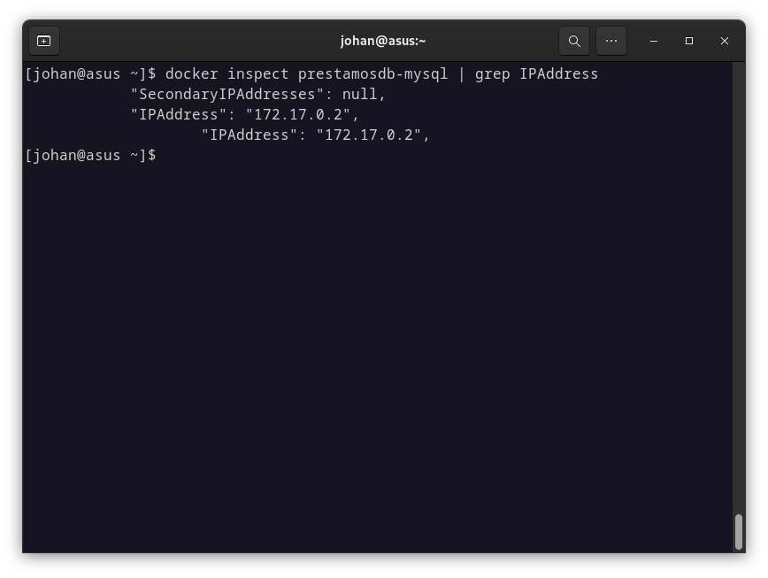

# Steps to Use this Project with Docker

First, run the database container in the terminal using the following command:

```bash
sudo docker run --name prestamosdb-mysql -e MYSQL_ROOT_PASSWORD=admin -p 3306:3306 -d mysql:latest
```

Then, open PhpMyAdmin to manage the database. You can run a container for it as well:

```bash
sudo docker run --name my-phpmyadmin-prestamosdb -d --link prestamosdb-mysql:db -p 8080:80 phpmyadmin/phpmyadmin
```

After that, you can open PhpMyAdmin in your browser:

```bash
localhost:8080
```

Execute the following command to get the Container’s `IpAddress`

```bash
docker inspect prestamosdb-mysql | grep IPAddress
```



Copy the **`IpAddress`** and go to the project. You should open it in the Development Container and then modify the **`.env`** file to ensure a successful database connection

```bash
DB_CONNECTION=mysql
DB_HOST=172.17.0.2  # Replace with the actual IP address of the MySQL container
DB_PORT=3306
DB_DATABASE=prestamosdb
DB_USERNAME=root
DB_PASSWORD=admin
```

Now, run the migrate command:

```bash
php artisan migrate
```

If the command is successful, then run:

```bash
php artisan serve
```

---

# Endpoints for Postman

### `Host`

```bash
localhost:8000
```

### Person

New

```bash
POST | /personas?{params}
```

The person's data goes in the request parameters

Get All

```bash
GET | /personas
```

Find by ID

```bash
GET | /personas/{id}
```

Delete

```bash
DELTE | /personas/{id}
```

Update

```bash
PUT | /personas/{id}?{params}
```

Find by Name

```bash
GET | /personas/nombre/{name}
```

Get Fiador

```bash
GET | /personas/{id}/fiador
```

Get Loans

```bash
GET | /personas/{id}/prestamos
```

---

### Loan

New

```bash
POST | /prestamos?{params}
```

Get All

```bash
GET | /prestamos
```

Find by ID

```bash
GET | /prestamos/{id}
```

Delete

```bash
DELTE | /prestamos/{id}
```

Update

```bash
PUT | /prestamos/{id}?{params}
```

---

### Fiador

New

```bash
POST | /fiadors?{params}
```

Get All

```bash
GET | /fiadors
```

Find by ID

```bash
GET | /fiadors/{id}
```

Delete

```bash
DELTE | /fiadors/{id}
```

Update

```bash
PUT | /fiadors/{id}?{params}
```